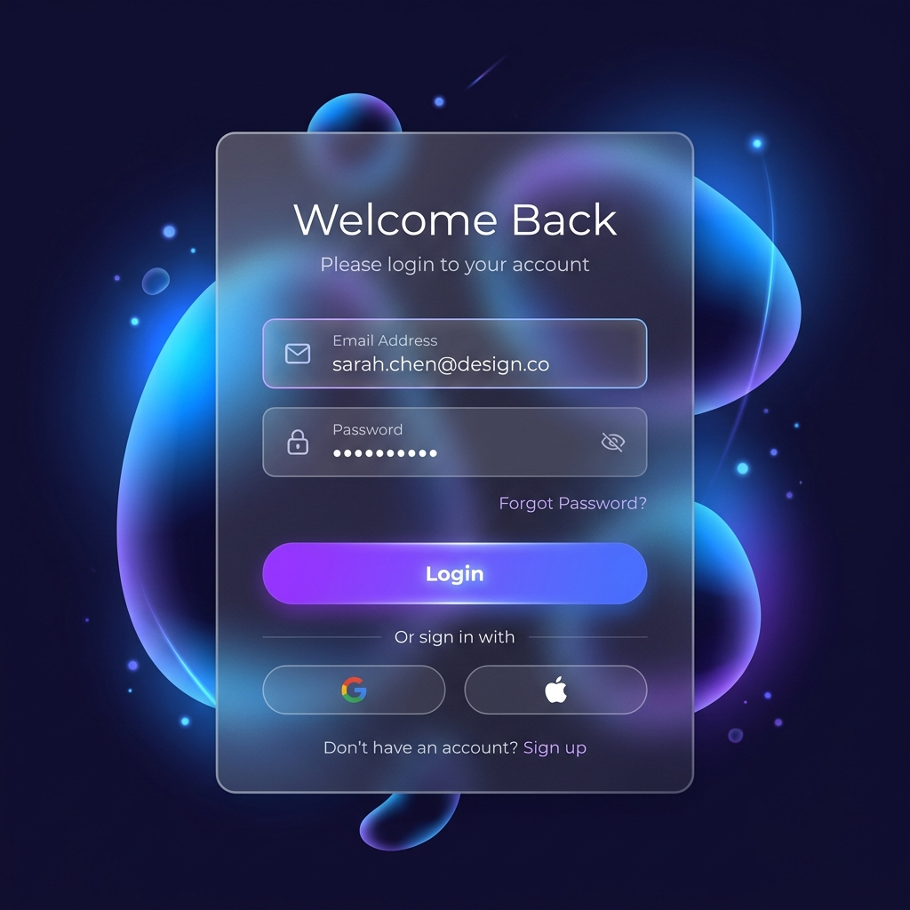

# Glassmorphic Responsive Form Design

A premium, modern Login, Signup, and Password Recovery interface built with HTML5, CSS3, and Vanilla JavaScript. Featuring a stunning glassmorphism design, dynamic background animations, and smooth state transitions.



## Features

- **Premium UI**: Modern glassmorphism (frosted glass) effect with `backdrop-filter`.
- **Dynamic Background**: Animated radial gradients and decorative blobs for a deep, immersive feel.
- **Three-State Switcher**: Seamlessly switch between **Login**, **Registration**, and **Forgot Password** forms.
- **Show/Hide Password**: Integrated toggle to view or hide password input.
- **Fully Responsive**: Optimized for desktop, tablet, and mobile devices.
- **Clean Code**: Zero dependencies, lightweight, and easy to customize.

## Technologies Used

- **HTML5**: Semantic structure.
- **CSS3**: Advanced styling, Flexbox, Keyframe animations, and Glassmorphism.
- **JavaScript**: Interactive form switching and password visibility logic.
- **Unicons**: Sleek vector icons for form fields.

## Getting Started

### Prerequisites

No special setup is required. Just a modern web browser.

### Installation

1. Clone the repository:
   ```bash
   git clone https://github.com/rajjitlai/Responsive-Form-Design.git
   ```
2. Open `index.html` in your favorite browser.

## Project Structure

```text
├── assets/          # Project images and screenshots
├── css/             # Stylesheets (Glassmorphic theme)
├── js/              # Interactive logic
├── index.html       # Main application entryway
└── LICENSE          # MIT License
```

## License

Distributed under the MIT License. See `LICENSE` for more information.

---
Crafted with ❤️ by [Rajjit Laishram](https://github.com/rajjitlai)
